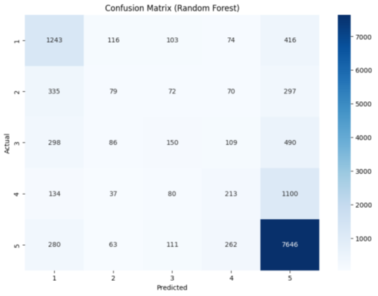

# Sentiment Analysis on Amazon Reviews

## Project Overview

This project focuses on predicting the star ratings (1–5) of Amazon product reviews by analyzing their sentiment using advanced machine learning and natural language processing (NLP) techniques. The primary goal is to develop and compare predictive models that estimate review ratings based solely on the textual content of customer feedback, providing valuable insights for both consumers and businesses on e-commerce platforms.

## Objectives

- Predict Amazon review star ratings from review text.
- Compare the effectiveness of different machine learning models, including traditional algorithms and deep learning approaches.
- Analyze the challenges and limitations of sentiment analysis in real-world e-commerce data.

## Dataset

The dataset comprises over 571 million Amazon product reviews across 43 categories (e.g., beauty, fashion, toys). Each review includes:

- **Rating**: The actual star rating (1–5), used as the prediction target.
- **Title**: The headline of the review.
- **Text**: The main review content.
- **Parent ASIN**: The product identifier (used for future work, not modeling).

For this project, the focus was on the Beauty and Fashion categories, both of which exhibited a strong class imbalance—about 60% of reviews are rated 5 stars.

## Data Preprocessing

Effective preprocessing was critical for model performance. The following steps were applied:

- **Feature Selection**: Only the rating, title, and review text were used.
- **Data Cleaning**:
    - Removed duplicates and handled missing data.
    - Concatenated the title and review text to preserve all sentiment cues.
    - Removed stopwords to reduce noise.
    - Lowercased all text for uniformity.
    - Stripped punctuation, as it adds little to sentiment analysis.
    - Lemmatized words to their base forms.
    - Embedded words into numerical vectors for model input.

**Example (after cleaning):**
> "lovely scent not overpower spray really nice smell really good go really fine trick say feel like need lot get texture want lot hair medium thickness compare brand yucky chemical go stick try"

## Modeling Approaches

Several models were implemented and compared:

### Naive Bayes

- Assumes feature independence and uses Bayes’ theorem.
- Gaussian Naive Bayes was chosen due to the continuous nature of the feature vectors.
- Performed best on class 5 (5-star reviews) but struggled with minority classes due to class imbalance.

### Random Forest

- Ensemble of decision trees (10 estimators used for efficiency).
- Handles high-dimensional data and captures complex feature interactions.
- Showed strong performance on class 5, but significant misclassifications for other classes, reflecting dataset imbalance.

### Logistic Regression

- Simple, interpretable linear model.
- Trained with up to 1000 iterations for convergence.
- Outperformed all other models in accuracy, recall, and F1-score, except for a marginally lower precision compared to RNN.

### Recurrent Neural Network (RNN) with Bidirectional LSTM

- Designed for sequential data, capturing context and word order.
- Architecture:
    - Bidirectional LSTM layers
    - Stacked LSTM layers for hierarchical learning
    - Dropout for regularization
    - Dense output layer for rating prediction
- Loss function: Mean Square Error; Optimizer: Adam; Metric: Mean Absolute Error
- Performed well on majority class but struggled with underrepresented classes.

## Results

**Model Performance Comparison:**

| Model | Precision | Accuracy | Recall | F1 Score |
| :-- | :-- | :-- | :-- | :-- |
| Naive Bayes | 0.66 | 0.52 | 0.52 | 0.57 |
| Random Forest | 0.61 | 0.68 | 0.68 | 0.63 |
| Logistic Regression | 0.68 | 0.72 | 0.72 | 0.67 |
| RNN (BiLSTM) | 0.69 | 0.63 | 0.63 | 0.66 |

- **Logistic Regression** achieved the highest overall accuracy and F1-score, outperforming the RNN except for a slight difference in precision.
- **RNN** required more data to match the performance of simpler models and worked best on classes with more samples (class 5).
- All models showed a bias toward predicting the majority class due to dataset imbalance.

*Confusion matrix Naive Bayes*

*Confusion matrix Random Forest*

*Confusion matrix Logistic Regresion*

*Confusion matrix RNN*

## Experimental Evaluation

Example predictions on test reviews:

| Review (cleaned) | Actual Rating | Predicted Rating |
| :-- | :-- | :-- |
| "highly recommended item good quality product" | 5 | 5 |
| "good quality fell apart almost immediately bead fell everywhere dangerous kid huge small kid head" | 1 | 1 |
| "nosepiece job nosepiece install easily enough adhesive hold long back drawing board" | 2 | 2 |
| "ok meh nothing special price disappointed already gone back vanicream for age 41 sensitive congestion prone skin" | 3 | 2 |

- The model generally predicts the correct rating for clear positive or negative reviews but struggles with ambiguous or neutral reviews.

## Challenges and Limitations

- **Class Imbalance**: Most reviews are 5 stars, causing models to favor this class.
- **Ambiguity and Sarcasm**: Difficult for models to detect nuanced sentiment.
- **Overfitting**: Deep models like RNNs require careful regularization and more data to generalize well.
- **Feature Overlap**: Some classes (e.g., 2, 3, 4 stars) have overlapping sentiment cues, making them hard to distinguish.

## Future Work

- **Address Class Imbalance**: Experiment with resampling techniques or class weighting.
- **Model Optimization**: Use more advanced architectures or hyperparameter tuning.
- **Expand to More Categories**: Incorporate additional product categories for broader applicability.
- **Integrate Product Metadata**: Use ASIN and other features for context-aware predictions.

## Social Impact

This project demonstrates how machine learning can automate the understanding of customer sentiment at scale, helping businesses improve products and services and empowering consumers to make informed decisions.

## Acknowledgments

- Project team: Antonio Castañares Rodriguez, Alonso Garcia Velasco, Ruben Garcia Llorente
- Illinois Institute of Technology

